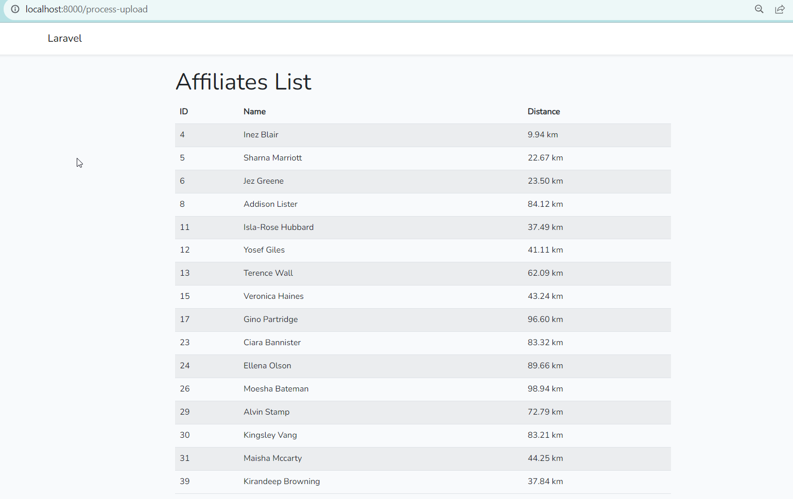
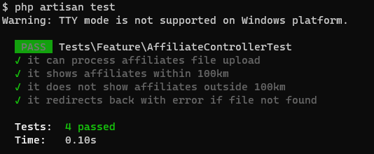

<H1 align="center">Affiliate Users</H1>
## Install Project

```html
  git clone https://github.com/Brightness999/affilate_user.git

  composer install

  cp .env.example .env

  php artisan key:generate

  php artisan serve
```

Running screenshots:




## Unit Testing

```html
  php artisan test
```

Running screenshots:


